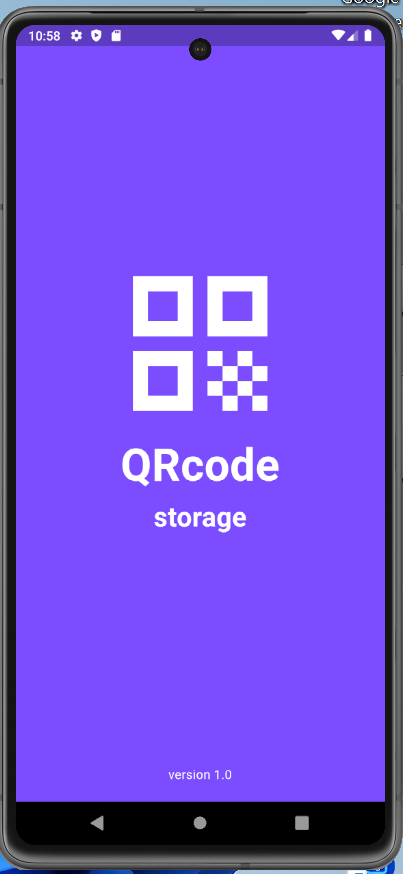
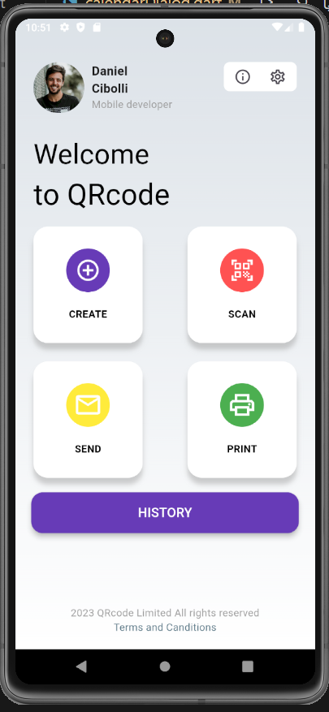
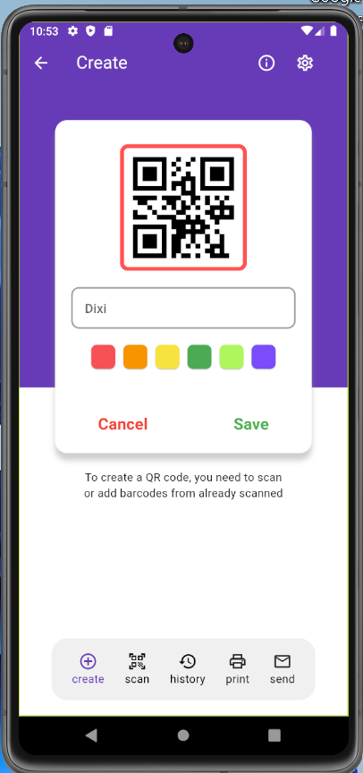
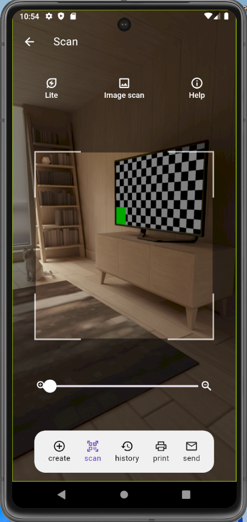
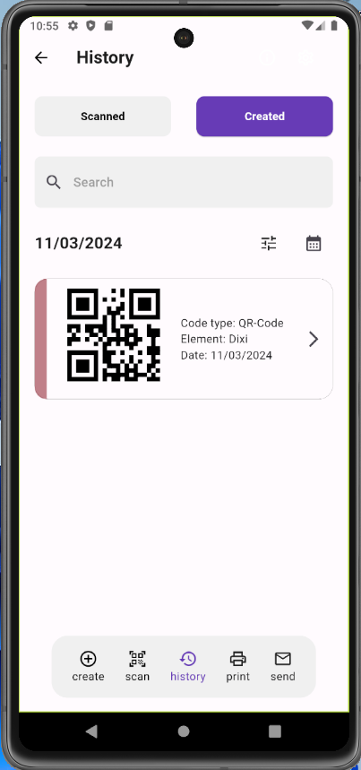
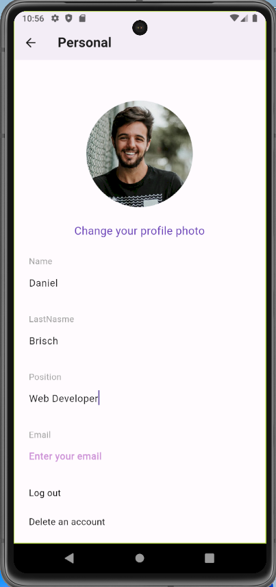
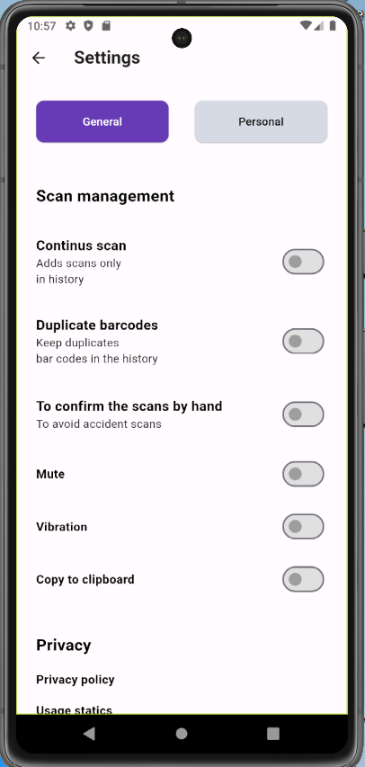

# Full QRCode Project

<!DOCTYPE html>
<html lang="en">
<head>
<meta charset="UTF-8">
<meta name="viewport" content="width=device-width, initial-scale=1.0">

</head>
<body>
    

        <h2>StartPage</h2> 
        
        <h2>HomePage</h2>
        
        <h2>CreatePage</h2>
        
        <h2>ScanPage</h2>
        
        <h2>HistoryPage</h2>
        
        <h2>PersonalPage</h2>
        
        <h2>SettingsPage</h2>
        
    

</body>
</html>
